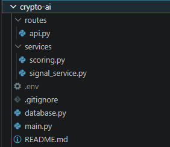
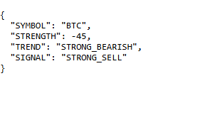
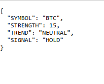

# Crypto AI Analysis API

A FastAPI and MongoDB powered cryptocurrency market analysis API that processes candlestick data, calculates technical indicators, evaluates market trends, and generates trading signals.

This project is designed as the analysis layer of a larger crypto intelligence platform. It consumes historical market data stored in MongoDB and produces trend, momentum, and signal analysis across multiple timeframes.

---

## Features

### Market Analysis

* Candlestick analysis
* Trend evaluation
* Momentum analysis
* Volatility analysis
* Signal generation
* Multi-timeframe support

### Technical Indicators

* EMA 9
* EMA 20
* EMA 50
* EMA 200
* SMA 20
* RSI 14
* ATR 14

### Derived Metrics

* EMA distance calculations
* EMA spread calculations
* ATR percentage
* Candle body percentage
* Upper wick percentage
* Lower wick percentage
* Range percentage

### Signal Engine

The API generates signals using a weighted scoring system based on:

* RSI behavior
* EMA alignment
* EMA distance changes
* EMA spread changes
* ATR changes
* Market structure
* Consecutive bullish/bearish candles
* Higher highs
* Lower lows

Signal outputs include:

* VERY_STRONG_BUY
* STRONG_BUY
* BUY
* HOLD
* SELL
* STRONG_SELL
* VERY_STRONG_SELL

Trend outputs include:

* VERY_STRONG_BULLISH
* STRONG_BULLISH
* BULLISH
* NEUTRAL
* BEARISH
* STRONG_BEARISH
* VERY_STRONG_BEARISH

---

## Why This Project?

This project was built to explore quantitative cryptocurrency analysis using technical indicators, trend scoring, and multi-candle momentum evaluation.

The goal is to create a foundation for future machine learning and AI-powered forecasting systems.

---

## Technology Stack

### Backend

* FastAPI
* Python
* Motor (Async MongoDB Driver)

### Database

* MongoDB

### Data Processing

* Technical indicator calculations
* Candlestick analytics
* Trend scoring
* Momentum scoring

---

## Architecture

Exchange Data
    ↓
MongoDB Storage
    ↓
Indicator Calculation
    ↓
Signal Scoring Engine
    ↓
Trend Classification
    ↓
Trading Signal

---

## Project Structure

```text
app/
│
├── api/
│   └── routes.py
│
├── services/
│   ├── signal_service.py
│   ├── scoring.py
│
├── database/
│   ├── mongodb.py
│
├── models/
│
├── main.py
│
└── requirements.txt
```

---

## API Endpoints

### Health Check

```http
GET /
```

Response

```json
{
  "message": "API SIGNAL!"
}
```

---

### Analyze Latest Candle

```http
GET /api/signal/by/last
```

Parameters

```text
symbol
timeframe
```

Example

```http
GET /api/signal/by/last?symbol=BTC&timeframe=15m
```

Response

```json
{
  "SYMBOL": "BTC",
  "STRENGTH": 87,
  "TREND": "STRONG_BULLISH",
  "SIGNAL": "STRONG_BUY"
}
```

---

### Analyze Last Five Candles

```http
GET /api/signal/by/lastfive
```

Parameters

```text
symbol
timeframe
```

Example

```http
GET /api/signal/by/lastfive?symbol=BTC&timeframe=1h
```

Response

```json
{
  "STRENGTH": 104,
  "TREND": "STRONG_BULLISH",
  "SIGNAL": "STRONG_BUY"
}
```

---

## Supported Timeframes

Examples:

* 5m
* 15m
* 1h
* 4h
* 24h

Additional timeframes can be added easily.

---

## Screenshots

### Project Structure



### API Response




---

## Roadmap

Planned future improvements:

* Candlestick pattern recognition
* Machine learning predictions
* Multi-timeframe aggregation
* Confidence scoring
* Historical backtesting
* AI forecasting models
* Sentiment analysis integration
* Automated report generation
* Trading strategy evaluation

---

## Installation

Clone repository

```bash
git clone https://github.com/ashkangl/AI-Price-Predictor.git
```

Install dependencies

```bash
pip install -r requirements.txt
```

Create environment variables

```env
MONGO_URL=your_mongodb_connection_string
```

Run server

```bash
uvicorn main:app --reload
```

---

## Disclaimer

This project is intended for educational and research purposes only.

The generated signals are not financial advice and should not be used as the sole basis for investment decisions.

Always perform your own research before trading.

---

## Author

Ashkan Golzad

Full Stack Developer

Node.js • Next.js • FastAPI • MongoDB • Cryptocurrency Analytics

## License

MIT